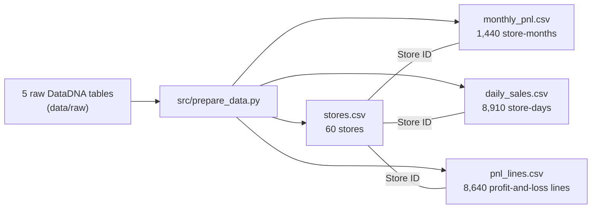

# Sunrise Coffee Chain: Profit Is Won on Costs

Tableau dashboard and Python analysis of a 60-store UK coffee chain (2023–2024), built for the
**DataDNA Dataset Challenge (October 2026)** and as a group project for **MLDS 430 Data
Visualization** at Northwestern University.


**Interactive dashboard:** [Tableau Public](TABLEAU_PUBLIC_LINK) · **Analysis notebook:** [`analysis/eda.ipynb`](analysis/eda.ipynb)

---

## The short version

Every store sells roughly the same (£56K–£71K a month, 5% variation), so **the differences in
profit come almost entirely from costs**. Labour cost explains 63% of the variation in store
profit and rent another 23%. The chain makes an 18.8% net margin on £89.7M of revenue over two years.

## Findings

| | Finding | Evidence |
|---|---|---|
| 1 | **Weekend staffing doesn't follow demand.** | Weekend sales are 24% below weekdays (£1,663 vs £2,196 per store-day), but staff hours are the same (41.6 vs 41.4). Revenue per labour hour drops from £53 to £40. All 60 stores show the weekend dip. |
| 2 | **The loyalty programme adds cost, not sales.** | Members' share of revenue equals the adoption rate (r = 0.998, slope 1.00): members spend exactly like non-members. Adoption has no link to store sales (r = 0.003) or margin (r = −0.01), yet rewards cost £1.73M over two years (10% of net profit). |
| 3 | **London pays twice the rent for the same sales.** | London stores sell £62.2K a month vs £62.3K elsewhere but pay £11.7K rent vs £5.8K. Net margin is 8.5% vs 20.2%, and 32% of London store-months lose money (13% elsewhere). Rent doesn't buy sales (r = 0.15). |
| 4 | **The weakest store has a labour problem, not a rent problem.** | South London Corner: −3.7% margin, a loss in 13 of 24 months. Staffing takes 52% of sales (median 31%), while its rent is the lowest in London. |
| 5 | **No real seasonality; the product mix is stable.** | 2023 and 2024 monthly patterns don't repeat (r = −0.35); quarters sit within ±1.5% of average. Mix is flat: espresso 46%, food 26%, filter 19%, retail beans 9%. |

## Recommendations

| | Action | Estimated impact |
|---|---|---|
| 1 | Match weekend staff hours to demand (about −25%), keeping a minimum crew per shift | ≈ £1.0M a year |
| 2 | Pilot smaller loyalty rewards in a few stores before changing the whole chain | up to £0.87M a year |
| 3 | Go slow on new London sites; put lower-rent regions first in the 2025 site programme | London needs a 55% rent cut to reach the UK average margin |
| 4 | Review South London Corner's staffing; if it can't be fixed, it is the first closure candidate | −3.7% margin today |

## What the data got wrong

Part of the work was checking the dataset against its own brief and data dictionary
([`analysis/eda.ipynb`](analysis/eda.ipynb), Part 1):

- **Profit status labels contradict their definition in 42% of rows** (600 of 1,440). 349
  store-months labelled "Profitable" have margins above 20%. The dashboard recomputes the
  status from net margin using the documented thresholds.
- **Only two store formats exist**, not three: 58 High-Street and 2 Transport-Hub stores.
  A format comparison would rest on two stores, so the dashboard compares regions instead.
- **Daily sales cover ~20% of store-days**, and 1,006 store-days appear more than once with
  conflicting totals. Repeats are averaged, and daily data is only used as per-day averages.
- **The "top product" field is unusable**: Christmas and pumpkin-spice items are the top seller
  on June days.

The P&L identities (net profit = revenue − costs; member + non-member spend = revenue) hold exactly.

## How it's built



- **Data prep (Python/pandas):** cleans labels, collapses duplicate store-days, adds weekday and
  calendar fields, and reshapes the monthly P&L into long format for the waterfall chart.
- **Data model (Tableau relationships):** `stores.csv` sits at the centre and each fact table relates
  to it on Store ID. The fact tables aren't joined to each other because they have different grains
  (store-day vs store-month); a join would duplicate rows and double-count totals.
- **Dashboard features:**
  - Clicking a store in either scatter plot filters the KPIs, waterfall and weekday chart, and
    highlights the same store in the other scatter.
  - A London rent slider recalculates London's margin and moves its bar in the region chart.
  - An info button shows the profit status definitions.

## Repository structure

```
├── README.md
├── analysis/eda.ipynb          data audit + every number used in the dashboard
├── src/prepare_data.py         raw tables -> 4 prepared CSVs
├── tableau/Sunrise_Coffee_Dashboard.twbx
├── images/dashboard.png
├── data/README.md              where to get the raw data
└── requirements.txt
```

## Reproduce

1. Download the dataset (see [`data/README.md`](data/README.md)) and put the five CSVs in `data/raw/`.
2. Install dependencies and build the prepared tables:
   ```bash
   pip install -r requirements.txt
   python src/prepare_data.py
   ```
3. Run `analysis/eda.ipynb`.
4. Open `tableau/Sunrise_Coffee_Dashboard.twbx` in Tableau Desktop or Tableau Public **2025.3 or newer**.
   The packaged workbook already contains its data extract.

## Limitations

- The daily table is a ~20% sample, so weekday/weekend results are averages, not full-year totals.
- The £1.0M staffing estimate assumes labour cost scales with hours; minimum crews would reduce it.
- The loyalty conclusion is observational. Only a controlled pilot can show what happens if rewards change.
- The Transport-Hub comparison rests on two stores.

## Credits

- Group project for MLDS 430 Data Visualization, Northwestern University, Fall 2026.
  Team: TEAM_MEMBERS
- Data: *Sunrise Coffee Chain* dataset, DataDNA Dataset Challenge by Onyx Data (October 2026).
